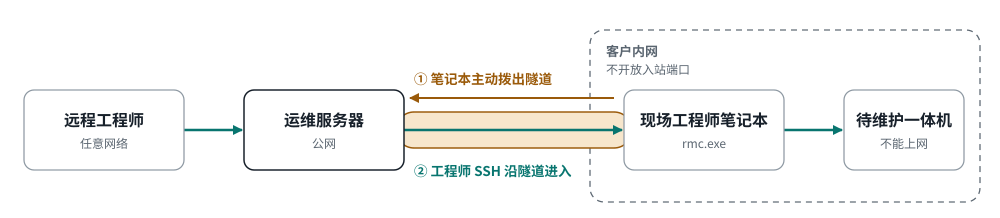

# Remote Maintenance Client 方案设计

## 1. 场景与目标

客户现场一体机部署在私有网络中，**无法访问互联网**。现场工程师使用 Windows 笔记本，可同时访问客户内网中的一体机和互联网。

目标：公司远程工程师通过现场 Windows 笔记本安全地 SSH 登录一体机进行运维，同时满足：

- 不改变客户网络结构，不开放客户侧入站端口，不在笔记本上启用 NAT、ICS 或网段转发；
- 只暴露一体机的 SSH 端口，不暴露客户网络中的任何其他地址；
- 所有连接由现场笔记本主动发起，由现场人员明确开启、可随时关闭、能看到谁在连接；
- 一体机不改镜像、不装 agent，方案对已交付设备零改动。

### 非目标

- 不做子网路由或 VPN 接入；
- 不在一体机上部署常驻 agent，不修改一体机镜像；
- V1 不做运维服务器侧会话录制（原因见第 10 节），不做客户端自动更新；
- 不做专门的文件传输功能，scp 与 sftp 天然走隧道。

---

## 2. 总体架构



下面这张字符图是同一件事的展开，带端口与协议细节：

```
公司远程工程师
      │  ssh -p 22003 root@203.0.113.10
      │  直连该账号的反向端口，输入一体机动态 root 口令
      ▼
┌──────────────────────────────────────────────────┐
│ 运维服务器   rmc-gateway   203.0.113.10          │
│   一个静态二进制，普通用户运行，不需要 root       │
│                                                  │
│  :22000        TLS 1.3 ──► 内置 SSH 服务端       │
│                只实现口令认证与一条反向转发       │
│  :22001-22999  反向端口，按账号固定，绑 0.0.0.0  │
│                随隧道上线出现，随隧道下线消失     │
└────────────────────────▲─────────────────────────┘
                         │ TLS 1.3，按连接码里的指纹核对服务器公钥
                         │   └─ SSH，russh，口令认证，反向端口转发
                         │ 笔记本主动发起，可经 HTTP CONNECT 代理
                     Internet
                         │
┌────────────────────────┴─────────────────────────┐
│ Windows 笔记本    Remote Maintenance Client       │
│   iced UI ◄── 事件 ── rmc-core（内嵌 russh）      │
└────────────────────────┬─────────────────────────┘
                         │ TCP 192.168.100.10:61001，本次会话唯一目标
                         ▼
┌──────────────────────────────────────────────────┐
│ 客户一体机   sshd   现状不变，root 动态口令登录     │
└──────────────────────────────────────────────────┘
```

两段认证相互独立：

1. **笔记本到运维服务器**：现场人员在客户端界面粘贴运维发来的**连接码**并输入口令。连接码是 `rmc1:<账号>@<IP>:<端口>:<指纹>:<校验>`，地址、账号与服务器指纹都在里面，界面上没有分开的地址框与账号框。账号不是系统用户，在服务器上开不了 shell——服务端**只实现**口令认证与一条反向转发，别的 SSH 请求在代码里就构造不出来（见 4.3）。
2. **工程师到一体机**：工程师用 `ssh -p <该账号的端口> root@<运维服务器 IP>` 直连反向端口，不登录运维服务器，在一体机的 SSH 提示符输入 root 动态口令。口令由公司内部服务按设备编号计算得出，逐台不同、可轮换。这一段是端到端加密穿过隧道的，运维服务器看不到口令。

反向端口默认绑 `0.0.0.0`，一体机的 SSH 端口因此对互联网开放，到达它不需要攻陷任何环节。一体机的动态 root 口令是唯一的登录屏障，它端到端加密、运维服务器不可见，服务器即使被完全攻陷也拿不到它。`serve --engineer-allow <CIDR>` 可以把反向端口的来源收窄到公司出口网段，默认不设。

---

## 3. 客户端设计

### 3.1 技术选型

| 项目 | 选择 | 理由 |
|---|---|---|
| 语言与运行时 | Rust，tokio | 核心逻辑跨平台可测 |
| SSH | russh，锁定版本 | 只用到连接、host key 校验、口令认证、tcpip-forward、forwarded-tcpip 五个能力；口令在界面输入，用回调直接送入，无需子进程；每个远程会话都是回调，可见可控 |
| TLS | rustls，只开 TLS 1.3 | 不用任何根证书库：只核对连接码里钉死的服务器公钥指纹并验证握手签名，不校验有效期、名称与证书链。既不受 Windows 证书库中企业注入根的影响，也不需要给服务器申请证书或域名 |
| GUI | iced | 纯 Rust；wgpu 不可用时回落到 tiny-skia 软件渲染，能在 RDP、虚拟机、无独显驱动机器上运行 |
| 托盘 | tray-icon crate | 最小化到托盘并用颜色表示状态 |

不采用驱动 `ssh.exe` 子进程的方案：BatchMode 会禁用口令认证，Windows 上无 sshpass，GUI 程序无法把界面输入的口令可靠喂给子进程。内嵌 russh 则是一次认证回调。

### 3.2 crate 划分

```
rmc/
├── crates/
│   ├── rmc-core     平台无关：连接码、传输层、SSH 隧道、状态机、重连、会话账目、审计
│   ├── rmc-win      Windows 适配：系统代理与 SSPI 代理认证、电源与网络事件、单实例、托盘、通知、DPAPI
│   ├── rmc-app      iced 界面
│   └── rmc-gateway  运维服务器：lib + bin，发布物是 x86_64-unknown-linux-musl 静态二进制
└── docs/
```

rmc-core 不依赖 Windows API；rmc-win 的平台能力以 trait 注入 core。rmc-gateway 依赖 rmc-core（两侧共用连接码与地址类型，不为二百行代码再开一个 crate）。端到端测试放在 `crates/rmc-gateway/tests/e2e.rs`：在一个进程里把真客户端内核、真服务端与一台假一体机接起来，不需要 docker。

### 3.3 核心组件

| 组件 | 职责 |
|---|---|
| Config | 日志目录等本地设置；一体机地址现场可编辑。运维服务器的地址、账号与指纹一律从连接码来，不是可编辑字段 |
| ConnectionCode | 连接码的解析、校验与格式化；字段私有，构造不出不合法的值 |
| Transport | 建立到运维服务器的字节流：TCP，可选 HTTP CONNECT（407 时委托平台层做 SSPI 协商），TLS 1.3 并核对指纹 |
| SshTunnel | 在字节流上运行 russh：核对 host key 指纹（与 TLS 那一层是同一个指纹）、口令认证、申请端口 0 并读回服务端分配的端口、处理每条转发连接 |
| Supervisor | 状态机、预检、重连、远程会话账目 |
| Preflight | 一体机 TCP、一体机 host key 指纹、运维服务器连通（直连或代理 CONNECT）、运维服务器 TLS 与指纹 |
| Audit | 本地追加式日志：状态变迁、每个远程会话起止与流量 |

core 对外只暴露 `TunnelEvent`、`Command`、`Supervisor::spawn`。凭据通过 `Command::Start { code, password, appliance_addr }` 一次性传入——连接码带着地址与账号，不再分别收运维服务器地址与账号——仅存于内存，会话结束时清除。

### 3.4 隧道建立流程

```
现场人员粘贴连接码、输入口令，确认一体机地址，点击"开启远程维护"
   │
   ▼
Preflight
   ├─ TCP 连接 一体机:61001，读取 host key 指纹
   ├─ TCP 连接 连接码里的 <IP>:<端口>（经代理时用 CONNECT，遇 407 用 SSPI 协商）
   └─ TLS 1.3 握手，核对服务器公钥指纹与连接码一致（不校验链、名称与有效期）
   │
   ▼
SshTunnel
   ├─ SSH 握手，核对 host key 指纹——与 TLS 那一层是同一个指纹；没有"首次连接自动信任"，也不留作后备
   ├─ 口令认证，提交连接码里的账号与界面输入的口令
   ├─ 发送 tcpip-forward 端口 0，服务端把该账号的端口回填进应答，客户端读回它并显示给工程师
   └─ 进入 Connected，每 10 秒 keepalive，连续无应答约 40 秒判定断线（实测值，见下方说明）
   │
   ▼
每当运维服务器打开 forwarded-tcpip 通道
   ├─ 校验监听端口为本次回填的那个端口
   ├─ TCP 连接一体机:61001，双向转发
   └─ 上报 RemoteSessionOpened / RemoteSessionClosed
```

转发目标是本次会话开启时确认的唯一地址，会话期间不可更改，远程侧无法更改。

> **「每 10 秒 keepalive，3 次无应答判定断线」这句话隐含的 30 秒，是一次从未实测过的
> 乘法。**（历史注记：V1 那套 OpenSSH 服务端上同样形状的乘法实测偏了约 2.7 倍——
> 约 80 秒而不是 30 秒；那套服务端已经退役，见第 11 章。客户端这一侧是 `rmc-core`，
> 用的是 russh，不是 OpenSSH，两者的判活实现不一定相同，所以下面是这一侧自己的实测，
> 不是从服务端那个数字推出来的。）
>
> **实测结果（Task 10）：约 40 秒，不是 30 秒。** 测法：`crates/rmc-core/src/
> supervisor.rs` 里 `keepalive_disconnect_is_measured_end_to_end_from_a_real_ssh_
> session` 这条测试，在进程内用 Task 7 交付的 russh 服务端夹具
> （`ssh::test_support::spawn_freezable_gateway`）建立一条真实的 `ssh::
> establish_over` 隧道（真的做 SSH 握手、口令认证、`tcpip-forward` 注册，走的是
> russh 客户端的 `keepalive_interval = 10s`/`keepalive_max = 3` 这两个生产配置，
> 见 `ssh::client_config`），隧道建好之后让连接"冻结"——读写都恒定
> 无响应但不报错、不断连，模拟网络黑洞（服务端真的不再应答，不是优雅挂断）——
> 掐表量从最后一次真实收到字节到 `Supervisor` 的状态机进入 `State::Backoff`
> 实际用了多久。用 `#[tokio::test(start_paused = true)]` 的虚拟时钟跑，结果是
> 确定性的 **40 秒整**（4 次 10 秒间隔的 keepalive 都未获应答后，russh 客户端
> 在 `alive_timeouts > keepalive_max` 时判定超时——`keepalive_max = 3` 意味着
> 第 4 次才越界，即 4×10=40 秒，不是 10×3=30 秒这个此前未经实测的乘法）；
> 因为是虚拟时钟，`cargo test` 跑这条用例不需要真的等 40 秒。不需要 docker，
> 也不需要真实网络。**这个数字目前只用于内部测试与文档，`Error::KeepaliveTimeout`
> 面向用户的 `Display` 文案里仍然不出现任何数字**，理由见该变体上的注释。
>
> **虚拟时钟为什么能代表真实经过的时间**：读过钉住版本 russh 0.63.3 的源码
> （`src/client/mod.rs` 主循环，约 1294 行起）确认——keepalive 定时器本身就是
> `crate::future_or_pending(self.common.config.keepalive_interval,
> tokio::time::sleep)`，每次触发后用 `tokio::time::Instant::now() + d` 重新
> `reset` 下一次到期时刻；整条判活路径（定时器、`alive_timeouts` 计数、超时
> 返回）都不碰 `std::time`，唯一出现非 tokio 时间的地方是 rekey 记账，跟
> keepalive 判活无关。`start_paused` 只替换 tokio 的时间源，不改变这段逻辑本身
> 的行为，所以虚拟时钟推进 40 秒与真实等待 40 秒对这条判活路径而言是同一件事，
> 不是"测试作弊"。
>
> **这是 SSH 层的判活上界，不是端到端断线时间**。夹具用 `Freezable` 包装内存
> 管道：冻结后读写永远返回 `Poll::Pending`，既不产生错误也不产生任何字节，模拟
> 一个理想化的黑洞——这样才能干净地隔离出"仅仅是 keepalive 计数"这一件事。真实
> 网络上的黑洞对端不是这样：TCP 层会先经历重传超时、发送缓冲区填满，最终由内核
> 的 TCP keepalive/重传放弃机制判定连接已死（`ETIMEDOUT`），这个过程可能比
> 40 秒更快也可能更慢，取决于系统的 TCP 参数——且 Windows 的默认 RTO/重传参数
> 与 macOS/Linux 不同。也就是说，真实世界里客户端判定断线的时间是
> `min(40 秒的 SSH 层 keepalive 判活, 操作系统 TCP 层放弃这条连接的时间)`，
> 40 秒只是 SSH 应用层这一侧的上界，不能当成端到端断线时间的完整答案；后者需要
> 在真实网络条件（含 Windows）下额外实测，这份实测目前只覆盖了前者。

### 3.5 状态机

```
Idle ──开启──► Preflight ──通过──► Connecting ──forward 成功──► Connected
                  │                    │                           │
                失败              致命错误                链路断开 / keepalive 超时
                  ▼                    ▼                           ▼
               Failed               Failed              Backoff(n) ──定时器或网络事件──► Connecting
                                                               │
Connected ──一体机探测失败──► Connected{degraded}          端口占用重试超时 ──► Failed
Connected ──用户停止或客户端退出──► Stopping ──► Idle
```

| 状态 | 界面 | 允许操作 |
|---|---|---|
| Idle | 灰色，一体机地址、连接码与口令可编辑 | 开启 |
| Preflight / Connecting | 蓝色，当前步骤与进度 | 取消 |
| Connected | 绿色，会话计时与远程会话列表 | 停止，断开某个远程会话 |
| Connected{degraded} | 橙色，"隧道正常，一体机不可达" | 停止 |
| Backoff(n) | 黄色，"第 n 次重连，x 秒后" | 停止，立即重试 |
| Failed | 红色，原因与建议 | 重试，查看诊断，停止 |

> Failed 下的「停止」是第四轮评审（R78）补上的，原表格里没有。理由是这里
> 有两条规格互相冲突，取安全那条：按本表，Failed 只允许「重试、查看诊断」，
> 于是「停止」是空操作；但 3.8（复审 R82 订正后）说清楚了口令要一直留到
> 会话真正结束才清——断线重连要复用同一份账号密码，没有界面能替它再问一遍。
> 「会话结束」的触发点之一就是现场人员点「停止」；如果 Failed 状态下连
> 「停止」都不算数，就没有任何出口能触发这次会话结束，那份 `Zeroizing
> <String>` 会一直留在内存里，直到下一次「开启」或进程退出。工程师遇到
> 失败之后合上笔记本走人，恰恰是最常见的收尾方式。「停止」本身表达的也是
> 「我不玩了」，在任何状态下可用符合直觉。「取消」保持不变——它表达的是
> 「取消正在进行的这次开启」，Failed 下没有正在进行的东西可取消。

### 3.6 错误分类与重连

| 类别 | 示例 | 处理 |
|---|---|---|
| 致命 | 服务器指纹与连接码不符（TLS 或 SSH 任一层） | 立即 Failed，不重试，界面指出两种可能：路径上有 TLS 审计设备，或连接码已过期（服务器换过身份密钥） |
| 认证失败 | 账号或密码错误 | 停止并回到 Idle，提示重新输入，不自动重试 |
| 端口占用 | tcpip-forward 被拒，上次僵尸监听未回收 | 固定 5 秒重试，最长 120 秒，超时 Failed |
| 网络类 | TCP/TLS/keepalive 失败 | 退避 1、2、5、10、20、30 秒封顶，附加 ±20% 抖动 |
| 一体机不可达 | 转发连接一体机:61001 失败 | 隧道保持，转 degraded，每 30 秒探测，恢复后转回 |

链路断开后重连时若原会话已通过认证，凭据仍在内存，可直接复用，无需再次输入。收到 Windows 网络变化或休眠恢复事件时清零退避并立即重连。认证失败不自动重试：服务端对同一来源 10 分钟内失败 10 次就封 15 分钟（它**不做**按账号锁定，理由见 4.4），自动重试只会把现场人员自己封在门外。

### 3.7 远程会话可见性

- 界面显示本次隧道的已连接时长；
- 每个远程会话单独列出起止、时长、流量，现场人员可单独断开；
- 远程会话打开与关闭时发送系统通知。

会话时长上限与空闲自动停止不在 V1 范围，见 7.3。隧道在现场人员手动停止或客户端退出前保持连接。

### 3.8 凭据与存储

- 目录 `%LOCALAPPDATA%\rmc\`；
- **连接码**由运维发放、现场人员粘贴；口令每次开启时在界面输入，存于进程内存；**默认不保存密码**。
  实现上不是"认证后立即清除"：链路断开后自动重连需要用同一份账号口令
  重新向运维服务器认证，没有界面能替它再问一遍，所以口令会一直留到
  会话真正结束——这之前的任何一次网络类退避重连都直接复用这份凭据，
  不会再向界面要一次。真正触发清除的时刻只有三个：现场人员点击"停止"
  （含 `Failed` 状态下的"停止"，这条本身是两条规格冲突时取安全那条
  优先的结果，见 3.5 表格下的说明）、运维服务器拒绝认证、或一体机与
  运维服务器的地址关系校验不通过。用 `Zeroizing` 包装承载，清除时底层
  缓冲区连带清零，不是仅仅释放一个引用；
- 若开启"记住密码"，用 DPAPI 当前用户范围加密后落盘，密文按「账号 + 地址 + 端口」定位；
- **服务器身份由连接码里的指纹钉死**：没有 `known_hosts` 文件，没有"首次连接自动信任"，也不留作后备；指纹对不上即拒绝连接且不重试；
- **反向端口由服务端分配**：客户端申请端口 0、读回服务端回填的值，二进制里既没有默认端口也没有允许端口表，界面上也没有填端口的地方；已连接时界面显示「远程工程师请连接 `<IP>` 端口 `<N>`」；
- 连接成功过的连接码写在 `connection-code.txt`，下次启动自动填好。它**不含秘密**（账号、地址、指纹都是公开信息），**存不存与"记住密码"无关**；
- 「盘上那份密文属于哪个 key」单独记在 `remembered-key.txt`，只在口令封存成功时写、取消勾选时删。它与上一条故意拆成两份文件：连接码那份每次连接成功都写，若两件事共用一份记录，一次失败的封存就能把别人的密文变成永久孤儿；
- 一体机地址与端口可现场修改，默认值内置（一体机 SSH 默认端口 61001）；
- 日志按天滚动保留 30 天，不记录口令与转发内容。

### 3.9 Windows 集成

- 单实例：命名互斥量，第二个实例置前已有窗口；
- 电源事件：休眠恢复后立即触发重连；
- 网络事件：连通性变化后立即触发重连；
- 系统代理：读取 WinHTTP/IE 代理配置，存在 PAC 时对运维服务器的地址求值（连接码只接受 IP，PAC 脚本拿到的就是这个裸 IP；个别企业代理按策略拒绝 `CONNECT` 到 IP 地址，遇上只能请客户网管放行）；
- 代理认证：代理对 CONNECT 返回 407 时，用 SSPI 协商 Negotiate 与 NTLM，直接复用当前登录用户的 Windows 身份，现场人员不需要输入代理凭据。协商失败时在诊断页明确报告代理要求认证，而不是笼统的连接超时；
- 不需要管理员权限，安装为按用户目录的便携包；
- 可执行文件做 Authenticode 签名，避免 SmartScreen 拦截。

### 3.10 界面

这台机器在界面上、在这份文档的正文里都叫**运维服务器**；`rmc-gateway`（crate 名、二进制名、数据目录 `~/.rmc-gateway`）是它的标识符，两个名字指的是同一台机器。改名的理由：早先的设计让工程师登录这台机器再跳转，用描述机制的名字是贴切的；改成直连、后来又整个换成一个自研二进制之后，机制味的名字早就不成立，而「运维服务器」说的是这台机器做什么用、不是它怎么实现。源码里有一道扫描守着这条——`Gateway` 与「网关」不许出现在任何会上屏的字符串里（`crates/rmc-core/src/wording.rs`）。

```
Remote Maintenance                        [ 维护 ]  诊断   日志

● 未开启        远程维护默认关闭，由现场人员确认后开启

维护目标
  一体机     [ 192.168.100.10 ] : [ 61001 ]

运维服务器
  连接码     [ rmc1:tunnel-zhang@203.0.113.10:22000:k3Jx…:9f2c ]
             地址 203.0.113.10:22000 · 账号 tunnel-zhang
  出网       ✓ 经系统代理 proxy.company.com:8080     自动检测
  密码       [ ••••••••••          ]
             已从本机取回记住的密码（能不能登录要等这次连接的结果）
  [ ] 记住密码   默认不保存，勾选后加密落盘

[ 开启远程维护 ]
开启后仅转发 192.168.100.10:61001，可随时停止
```

表单按两段连接分组：维护目标只放被维护的一体机；运维服务器那一组是连接码、出网、口令与「记住密码」。出网留在这一组里是因为它是「到达这台服务器」所用的路径，PAC 脚本正是拿运维服务器的地址求值的，换个目标可能解析出不同的代理。

地址、端口、账号与指纹合成**一个**连接码输入框，不再各占一行。理由不是省地方：这四样必须互相对得上——指纹是钉死这台服务器的唯一依据，分成四个框就等于允许现场人员把它们拼错，而拼错的后果不止是连不上，还可能是连到别处去。解析成功后在框下只读显示「地址 … · 账号 …」，让人能核对自己粘对了；解析失败则在框下红字说明是格式不对、校验不符，还是填了域名（连接码只接受 IP）。原先那一行「远程接入 `<地址>:<端口>` 由运维分配」随之消失——端口不再是运维配发给客户端的配置，而是服务端在隧道建立时回填的结果，未开启时客户端根本不知道它。

连接成功后凭据区隐藏、连接码与一体机地址锁定，改为显示远程接入提示与远程会话：

```
● 已连接   隧道已建立，远程工程师可以接入一体机          00:34:14

远程工程师请连接 203.0.113.10 端口 22003

维护目标
  一体机     192.168.100.10 : 61001

运维服务器
  连接码     rmc1:tunnel-zhang@203.0.113.10:22000:k3Jx…:9f2c
             地址 203.0.113.10:22000 · 账号 tunnel-zhang
  出网       ✓ 经系统代理 proxy.company.com:8080     自动检测

远程会话   2 个进行中
  #1  11:14 起   32 分 58 秒   发往一体机 1.2 MB · 来自一体机 340 KB   [断开]
  #2  11:41 起    6 分 04 秒   发往一体机  98 KB · 来自一体机  22 KB   [断开]

[ 停止远程维护 ]
```

「远程工程师请连接 …」那一行**只在已连接且真的拿到了回填端口时**才画出来：端口是服务端这一次分配的结果，不是本机的配置，重连期间那个值还留着上一轮的、连接码解析不出来时也拼不出这一行——这三种情形都不该画。现场人员把这一行念给远程工程师即可。

工程师那一侧的 `known_hosts` 记在运维服务器的地址与端口上，而不同的一体机会先后复用同一个端口，host key 变更告警于是成为常态并被忽略。一体机的 host key 指纹因此显示在诊断页与诊断包里，它是工程师确认自己连到了目标设备的唯一依据。

诊断页逐项显示预检四项：一体机 TCP、一体机 host key 指纹、运维服务器连通、运维服务器 TLS 与指纹。它区分 TCP 被拒、需要代理、代理要求认证且协商失败、TLS 被中间设备拦截、指纹与连接码不符、口令被拒。「域名解析」那一项没有了——连接码只接受 IP。导出诊断包生成 zip，含脱敏日志与预检结果。

---

## 4. 运维服务器设计

V1 的服务端由 haproxy、一个隧道专用 sshd 实例、PAM 与几个 shell 脚本拼成，**已经整体退役**（原因见第 11 章）。现在它是一个自研的 Rust 二进制 `rmc-gateway`：lib + bin，发布物是 `x86_64-unknown-linux-musl` 静态链接的单个文件。部署步骤见 [`docs/运维服务器部署.md`](运维服务器部署.md)。

### 4.1 形态与 CLI

在一台干净的 x86_64 Linux 上，以一个普通用户的身份拷一个文件过去、`init`、`serve`，再在防火墙上放行 22000–22999 这一段，就能工作。不装任何软件包，不要域名，不要证书，**不需要 root**。

```
rmc-gateway init --public-addr 203.0.113.10:22000
rmc-gateway serve [--listen 0.0.0.0:22000] [--engineer-allow <CIDR>]... [--allow-root]
rmc-gateway account add <名字> [--port N] [--note <文字>]
rmc-gateway account passwd <名字>
rmc-gateway account revoke <名字>
rmc-gateway account list
rmc-gateway status
rmc-gateway fingerprint
rmc-gateway service print
```

- **默认监听 22000**，反向端口 22001–22999，全是非特权端口，防火墙一条规则放行一整段；
- `serve` **发现自己是 root 就拒绝启动**并说明原因，`--allow-root` 只为「容器里只有 root」留。既然不需要特权端口就没有理由当 root——让错的东西构造不出来，而不是写一句「建议不要」；
- 二进制自己不建用户、不写 `/etc`、不调 `systemctl`。`service print` 只把一份 systemd 单元文本打印到标准输出（`User=` 填当前用户、`Restart=on-failure`、`NoNewPrivileges=yes`、`ProtectSystem=strict`、`ReadWritePaths=<数据目录>`），装不装由管理员决定；
- CLI 与 `serve` 应当由同一个用户运行，数据目录属主不是当前用户时 CLI 拒绝并说明；
- `--listen`（进程真正监听的地址）与 `public_addr`（写进连接码、客户端真正拨的地址）是**两个独立的值**。客户出网只放行 443 时，在服务器防火墙或云厂商端口映射上把公网 443 转到本机 22000、把 `config.toml` 的 `public_addr` 改成 `<IP>:443`、再用 `account list` 重发连接码即可，不需要 root 进程。（`init` 不能重跑——身份密钥已存在时它拒绝覆盖。）

### 4.2 数据目录与「没有 IPC」

默认 `~/.rmc-gateway`（`--data-dir` 或环境变量 `RMC_GATEWAY_DATA` 可改）。目录 `0700`，文件 `0600`。

| 文件 | 内容 |
|---|---|
| `identity.key` | ed25519 身份密钥。`init` 生成，已存在则拒绝覆盖 |
| `config.toml` | `public_addr`（只用于打印连接码）、反向端口区间（默认 22001–22999） |
| `accounts.toml` | 每个账号：名字、端口、口令的 argon2id 哈希（PHC 字符串）、是否启用、创建时间、备注 |
| `accounts.lock` | 把并发的 CLI 调用串行化的锁文件 |
| `status.json` | `serve` 在状态变化时原子写出：在线隧道、端口、来源地址、各自的工程师连接数 |
| `audit/audit-YYYY-MM-DD.log` | 审计日志，JSON Lines，保留 180 天 |

CLI 与服务进程之间**没有 IPC**，也没有需要重载配置的信号：

- CLI 改 `accounts.toml` 一律「写临时文件 → rename」，并用锁文件串行化；
- 服务端在**每次认证**时读账号（按 mtime 缓存），所以新开通的账号立刻可用；
- 服务端每个心跳周期（10 秒）复查每条在线隧道的账号是否还存在且启用，不是就立即拆掉——**吊销最迟 10 秒内踢掉在线会话**；
- `status` 读 `status.json`，**按文件的更新时间**判断进程是不是真的在跑（超过 30 秒没更新即判为没在跑），不会打印一份过期的在线列表。文件里的 pid **不参与判活**，只是打印出来供 `systemctl`/`ps` 交叉核对——`kill -9` 之后的头 30 秒里 `status` 仍会报「运行中（pid N）」，而那个 pid 已经不指向任何进程。

换身份密钥等于换身份，所有连接码作废、必须重新发放。**备份数据目录。**

### 4.3 只实现两件事

口令认证，与一条反向转发。除此之外的一切——公钥认证、`session` 通道（因而 shell、exec、sftp、pty 全都无从谈起）、正向转发、agent 与 X11 转发——**不实现**，russh 对未实现的回调默认就是拒绝。这是「让错的东西构造不出来」，而不是靠配置去禁掉一个功能齐全的 sshd：V1 那份 `sshd_tunnel_config` 里二十来行禁令（`ForceCommand /bin/false`、`PermitTTY no`、`AllowAgentForwarding no`、`PermitOpen none`…）整个消失了，因为没有实现就没有要禁的东西，也就没有「漏写一行禁令」这种失败形态。

端口由服务端定：

- 端口在**开通账号时**固定：取区间（默认 22001–22999）里最小的空闲号，或由 `--port` 指定（必须在区间内、未被别的账号占用、且不等于监听端口）；
- 客户端申请端口 **0**，服务端把该账号的端口填回应答（RFC 4254 §7.1）。客户端申请了非 0 且不等于账号端口的，拒绝；
- 一个账号同一时刻只有一条隧道；每条隧道最多 16 条并发的工程师连接；
- 反向监听绑 `0.0.0.0:<端口>`。`--engineer-allow <CIDR>` 可以重复给，给了就只接受这些来源的工程师连接；**默认不设，即反向端口公网可达**（7.1 已明确接受的取舍）。白名单在 accept 之后判断，不改绑定地址。

**断开即回收**：服务端每 10 秒发一次心跳，连续 3 次没有回应判定失联。隧道一断（TLS 连接关闭，或心跳失联），**立即**关掉监听、断开它的全部工程师连接、释放端口。同一个账号在旧会话还没被判死之前再次登录，维持既有语义：认证通过，申请转发时被拒（端口占用），客户端按 3.6 里那个 120 秒预算重试——等待时间从 V1 实测的约 80 秒降到 30–40 秒。

### 4.4 原来由 sshd、PAM 与 haproxy 扛的，现在自己扛

| 项 | 做法 |
|---|---|
| 口令存储 | argon2id，PHC 字符串。初始口令由程序生成（18 字节随机，base64）；`account passwd` 重置并只显示一次 |
| 账号存在性 | 账号不存在或已停用时**也跑一次等价的哈希**，失败应答的形状与耗时跟「口令错」一致——不泄露账号是否存在 |
| 单连接 | 最多 3 次尝试；每次失败统一延迟 1 秒 |
| 按来源 IP | 10 分钟内失败 10 次 → 封 15 分钟。**不做按账号锁定**——那等于给了攻击者一个锁死合法账号的开关 |
| 未认证连接 | 从 TCP 建立到认证通过限 20 秒；未认证连接全局最多 64 条、每个 IP 最多 8 条 |
| 审计日志 | 服务启动；认证成功与失败（账号、来源 IP）；来源封禁；隧道建立与拆除（含原因）；工程师连接的起止（来源 IP、端口、时长、双向字节数）与被拒的工程师连接；账号的增删改 |

审计日志是 JSON Lines，一天一个文件，保留 180 天，**不写口令**，失败的认证只记账号名与来源。**这是 V1 明确缺的那一块**：V1 里 sshd 看到的来源永远是 127.0.0.1（haproxy 终止 TLS 之后转本地），真实来源只在 haproxy 日志里、要靠时间戳去对；现在记下来的直接就是真实地址。

### 4.5 一把密钥，一个指纹

`init` 生成一把 ed25519 身份密钥，它同时是两样东西：

- **TLS**：用它自签一张 X.509 证书。证书在每次 `serve` 启动时现生成、只在内存里——客户端核对的是公钥，证书的有效期、名称与链都无关紧要；
- **SSH**：同一把密钥就是 host key。

**指纹 = 这把密钥 32 字节公钥的 SHA-256**，写成不带填充的 base64url（43 个字符）。客户端在两层各核对一次**同一个**指纹：TLS 一侧取证书里的公钥，SSH 一侧取 host key 的公钥。

**只开 TLS 1.3。** 两端都是我们自己的，没有兼容包袱；而且 TLS 1.3 的证书是加密传输的，路径上的被动检测设备看不到「签发者不受信任」。会失败的只有真的在做中间人的审计设备——那正是应当失败的情形，客户端此时给出的处置建议与「证书不受信任」那一条相同（请客户网管对这个 IP 与端口免做 TLS 审计）。

### 4.6 连接码

```
rmc1:<账号>@<IP>:<端口>:<指纹>:<校验>
rmc1:tunnel-zhang@203.0.113.10:22000:k3JxQm…（43 个字符）…:9f2c
```

- 账号 `[a-z0-9][a-z0-9-]{0,31}`。不再要求 `tunnel-` 前缀——那个前缀原本是为了跟系统用户区分开，现在账号根本不是系统用户；
- IP 是 IPv4 点分十进制，或方括号里的 IPv6。**不接受域名**；
- 校验是前面全部内容（到最后一个 `:` 之前）的 SHA-256 的前 4 个十六进制字符。它只防粘贴截断与手误，不是安全措施；
- **连接码里没有秘密**：可以走普通渠道发，可以存在本机，`account list` 随时能重取。**口令单独发。**

`account add` 的输出：

```
账号 tunnel-zhang 已开通，端口 22003。
连接码：  rmc1:tunnel-zhang@203.0.113.10:22000:k3Jx…:9f2c
初始口令：XXXXXXXXXXXXXXXXXXXXXXXX      （只显示这一次）
远程工程师：ssh -p 22003 root@203.0.113.10
```

指纹从第一次连接起就是钉死的。客户端**没有**「首次连接自动信任」这条路，也不留作后备——留了后备，钉死就形同虚设。这同时兑现了 7.3 里「固定 host key 列表并取消首次连接信任」那一条。

### 4.7 工程师直连

反向端口绑 `0.0.0.0`，工程师一条命令直连一体机，口令为该设备的动态 root 口令：

```
ssh -p 22003 root@203.0.113.10
```

工程师在运维服务器上不需要账号，服务器也不参与这一段的认证。相应地，两项原有的设计性质仍然是放弃状态：

- 运维服务器不记录**谁**在什么时间访问了哪台一体机——它记得到工程师连接的来源 IP、端口、时长与流量（4.4），记不到工程师的身份；
- 不再有逐工程师的凭据可供吊销。

把这两项补回来的手段见第 10 节（bastion）。

---

## 5. 一体机侧

**一体机不做任何改动。** root 采用动态或高强度口令，由公司内部服务按设备编号计算得出，逐台不同、可轮换。工程师维护时从内部服务取当台设备的当前口令，在 SSH 提示符输入。口令仅在工程师到一体机的端到端加密通道中传输，运维服务器不可见。

---

## 6. 身份与端口

- 隧道账号绑定人（现场工程师），不绑定笔记本，客户端二进制统一，无需逐台注册；账号**不是系统用户**，只是 `accounts.toml` 里的一条记录；
- **反向端口由服务端在开通账号时分配**：取区间（默认 22001–22999）里最小的空闲号，`--port` 可指定。客户端既不知道也填不了端口——它申请端口 0，由服务端回填（见 4.3）。每账号一个端口，一次维护一台一体机；
- 开通：`rmc-gateway account add <名字>` 一条命令——分配端口、写 `accounts.toml`、打印**连接码**与**一次性初始口令**。连接码不含秘密可走普通渠道，口令单独发。**没有第二份需要人工同步的登记表**：V1 的 `registry.toml` 连同三个脚本一起退役了，「吊销之后忘了从登记表删记录、下一次 enroll 把端口放行重新生成出来」这种失败形态随之消失；
- 口令重置：`account passwd <名字>`，新口令只显示一次。口令自助修改这一轮不做，记在 `docs/交付前还剩什么.md`；
- 吊销：`account revoke <名字>`——账号停用，最迟 10 秒内踢掉在线会话，**端口保留、账号名不再可用**。不给别人复用是刻意的：复用会让审计日志里同一个账号名跨越两个人。

---

## 7. 安全设计

### 7.1 威胁模型

| 攻击者 | 能拿到 | 拿不到 | 控制措施 |
|---|---|---|---|
| 被盗或被入侵的笔记本 | 连接码，以及开启了记住密码时的隧道口令，可建立隧道 | 运维服务器上的 shell、别的端口、一体机登录 | 默认不存密码，存则 DPAPI 绑定 Windows 账号；该账号只能绑它自己那一个端口，且端口由服务端定；账号可吊销，最迟 10 秒踢掉在线会话 |
| 连接码调包 | 现场人员的隧道口令 | 一体机登录，仍需动态 root 口令 | 指纹在连接码里钉死，TLS 与 SSH 两层各核对一次，没有首次信任可利用。代价是连接码本身必须经可信渠道交付——把现场人员引向一台假服务器，只需要换掉这一行字 |
| 被完全攻陷的运维服务器 | 通过在线隧道到达一体机 :61001，这一点已不需要攻陷任何东西 | 一体机 root 口令（端到端加密，运维服务器不可见） | 口令由内部服务计算，逐台不同、可轮换；服务端实现面极小（只有口令认证与一条反向转发），以普通用户运行、`serve` 是 root 就拒绝启动 |
| 互联网扫描 / 暴力破解者 | 直连一体机 sshd，端口在 22001–22999 内连号分配、可枚举；对一体机 root 账号的认证尝试次数不受限制 | 一体机 root 口令；运维服务器的账号口令 | 一体机侧只有动态 root 口令的强度与轮换；运维服务器侧按来源限流（单连接 3 次、每次失败延迟 1 秒、同一来源 10 分钟 10 次失败封 15 分钟、未认证连接有时限与数量上限），`--engineer-allow` 可把反向端口的来源收到公司出口网段。端口收回内网与打散端口号见 7.3 |
| 越权 / 恶意工程师 | 取到口令即可登录对应在线一体机 | 客户网络其他地址 | 一体机侧留 sshd 日志；运维服务器记得到工程师连接的来源 IP、端口与流量，记不到工程师身份；口令按设备隔离并轮换；V2 引入取口令审批与 RBAC |
| 客户内网攻击者 | 观察到笔记本到一体机的 SSH 连接 | 运维服务器的端口、隧道内容 | 笔记本不监听任何入站端口 |

到达一体机 SSH 端口不再需要攻陷任何环节：反向端口默认绑 `0.0.0.0`，互联网上任何人都能连上它。唯一的登录屏障是一体机的动态 root 口令，它端到端加密、运维服务器不可见，其强度与轮换周期因此直接决定了整个方案的安全边界。`--engineer-allow` 能把这个暴露面收窄到公司出口网段，但它是可选项，默认不设。

### 7.2 最小权限清单

- 一体机始终不能访问互联网；
- Windows 不开启 NAT、ICS 或网段转发，客户端不监听任何入站端口；
- 客户端只把运维服务器打开的通道转发到本次会话确认的唯一一体机地址；
- 反向端口逐账号只有一个，由服务端在开通账号时分配并记在 `accounts.toml` 里，客户端填不了也改不了；
- 笔记本到运维服务器用专用低权限口令；服务器身份由连接码里的指纹钉死，两层各核对一次，不符即拒绝且不重试；
- **服务端只实现口令认证与一条反向转发**——别的 SSH 请求不是被配置禁掉的，是根本没有实现；隧道账号不是系统用户，开不了 shell 也转发不到别处；一体机 root 口令动态且逐台隔离；
- 运维服务器以普通用户运行（`serve` 发现自己是 root 就拒绝启动），数据目录 `0700`、文件 `0600`，二进制自己不做任何需要特权的事；
- 远程维护默认关闭，由现场人员开启，每个远程会话可见可断，可随时停止；
- 客户端退出、崩溃或被强杀时隧道随进程消亡；服务端侧最迟约 30 秒（心跳 10 秒 × 3）判死并立即释放端口，无残留。

---

### 7.3 后续加固（V1 不做）

V1 以打通功能为先，下列措施排在功能之后，每一项都不改动整体架构。**划掉的是本轮换服务端时已经落地的**：

- 把反向端口从公网收回：**部分落地**——`serve --engineer-allow <CIDR>` 可按来源网段过滤（可重复给）；默认仍不设，绑内网网卡那一半还没做；
- 在一体机之前恢复一个认证点，重建逐工程师可吊销的凭据（~~访问记录~~ 那一半已落地：服务端记录每条工程师连接的来源 IP、端口、时长与双向字节数，见 4.4；**身份**仍然记不到）；
- 反向端口改为不连号分配，使 22001–22999 区间不能被顺序枚举；
- ~~固定 host key 列表并取消首次连接信任，防止假服务器收集隧道口令~~ —— **已落地**：指纹写在连接码里、TLS 与 SSH 两层各核对一次，没有首次信任，也不留作后备（4.5、4.6）；
- 认证加入第二因素，客户端只多一个输入框（PAM 栈没有了，这一条现在要自己实现）；
- ~~失败锁定与按来源 IP 限速~~ —— **已落地**：单连接 3 次、每次失败统一延迟 1 秒、同一来源 10 分钟 10 次失败封 15 分钟、未认证连接有时限与数量上限（4.4）。按账号锁定**刻意不做**，那等于给攻击者一个锁死合法账号的开关；
- 会话时长上限与空闲无远程会话自动停止，参数可现场调小；
- 记住密码从 DPAPI 升级为绑定设备的凭据保护；
- 工程师侧引入 bastion 做集中授权与会话录制，见第 10 节。

---

## 8. 测试策略

- **进程内端到端，不再有 docker。** `crates/rmc-gateway/tests/e2e.rs` 在一个进程里把真客户端内核（rmc-core 的 `Supervisor`）、真服务端（rmc-gateway 的 lib）与一台假一体机（一个 russh 服务端）接在一起。替掉的是 V1 那套 `docker compose` 起 haproxy + sshd-tunnel + 模拟一体机的夹具，以及它那 17 条只在 `--ignored` 下才跑的用例——**「跑没跑」这件事不再取决于有没有人记得传 `--ignored`**；
- 用例：正常建链与转发；口令错误后停止且不自动重试；指纹不符时拒绝连接且不重试；服务端断开后按网络类退避重连；端口占用重试；一体机 sshd 停止转 degraded 并在恢复后转回；HTTP CONNECT 代理路径；代理返回 407 后走 SSPI 协商；断线重连复用内存中凭据；吊销在 10 秒内踢掉在线会话；服务端重启后重连；
- 服务端自己的用例至少覆盖：4.3 里每一种被拒绝的 SSH 请求；端口分配与回填；4.4 表里的每一行（含「账号不存在」与「口令错」不可区分）；隧道断开后端口立即可以重新绑定；CLI 并发改账号不丢更新；连接码的解析与校验；
- rmc-win 平台能力以 trait 注入，core 测试用假实现；
- **CI**：`core` 工作流跑 rmc-core 与 rmc-gateway 的全部测试（含上面那批端到端），外加一个 job 产出 musl 静态二进制并上传，再加一个 `cargo deny`；`app` 工作流在 Linux 与 **Windows** runner 上各跑一遍 rmc-win / rmc-app / rmc-gateway——**配置上**同一批端到端在 Windows runner 上也会跑（`-p rmc-gateway` 会带上 `tests/e2e.rs`），并产出便携包。**注意这一条还没有被兑现过**：`-p rmc-gateway` 这个参数从未在任何一次 Windows runner 上执行过（`app.yml` 上一次真跑是在加它之前），第一次 push 时要盯住这个 job；
- Windows 手工验收：休眠恢复、Wi‑Fi 切换、有线切无线、企业代理与 PAC、需要认证的代理、RDP 下界面渲染、双开、强杀后无残留连接、记住密码的 DPAPI 读写。清单见 `docs/windows-验收清单.md`。

---

## 9. V1 交付范围

```
客户端
  rmc-core：连接码、Transport（CONNECT 代理与 TLS 1.3 指纹核对）、SshTunnel（口令认证、端口 0 回填）、Supervisor、Preflight、Audit
  rmc-win：系统代理与 SSPI 代理认证、电源与网络事件、单实例、托盘、通知、DPAPI 记住密码
  rmc-app：主界面（连接码 + 口令）、诊断页、日志页、诊断包导出
  代码签名与便携包

运维服务器
  rmc-gateway：一个 x86_64-unknown-linux-musl 静态二进制
    init / account add|passwd|revoke|list / serve / status / fingerprint / service print
    argon2id 口令库、按来源限流、审计日志、systemd 单元文本
  不需要域名、证书、软件包与 root；没有要维护的第二份登记表

一体机
  不改动，仅确认动态 root 口令服务可用并接入工程师取口令流程

文档
  使用手册、运维服务器部署手册、Windows 验收清单、方案设计
```

---

## 10. 演进路线

- **bastion**：候选 Warpgate，Rust 实现，自带 Web 管理、OIDC 单点登录、TOTP、角色到目标授权、SSH 会话录制回放。每个反向端口配为一个 target，工程师经 bastion 登录，由 bastion 在连接时向内部口令服务取一体机口令，工程师不再直接接触 root 口令。代价是 bastion 终止 SSH 后再连一体机，牺牲端到端加密换取录制与集中吊销，需在 V2 立项时明确取舍。引入 bastion 同时也是把 4.3 的直连所放弃的两项性质补回来的手段：一体机之前重新有了认证边界，谁在什么时间访问了哪台设备重新有了记录。
- **设备登记服务**：在 `accounts.toml` 之上提供 Web 管理、维护审批与取口令审计。动态端口分配与在线状态已经由运维服务器自己做了（4.2、4.3）。
- **多一体机并发维护**与**客户端自动更新**。

---

## 11. 已考虑但未采用的方案

| 方案 | 未采用原因 |
|---|---|
| 驱动 ssh.exe 子进程 | 与页面输入口令认证不兼容（BatchMode 禁用口令、无 sshpass）；还需 Job Object、私钥 ACL、stderr 解析、自写 ProxyCommand；无法感知单个远程会话 |
| 一体机内置证书 / CA | 需改镜像，且一体机长期离线时钟漂移导致证书校验失败；动态口令方案对已交付设备零改动 |
| frp 或 rathole | 认证不在 SSH 体系内，有历史 CVE，向客户安全团队解释成本高 |
| 覆盖网络：NetBird、Headscale、Tailscale | 需在接入客户内网的笔记本上装虚拟网卡与常驻服务，客户合规风险高 |
| GPUI | Windows 后端成熟度、软件渲染回落、托盘支持均未验证，对单窗口面板过重 |
| haproxy + sshd-tunnel（V1 原方案） | 第一次真要部署时暴露出部署路径从未验证、隧道账号可经系统 sshd 绕过限制、账号端口与客户端对不上三件事；换成自研二进制之后依赖归零、来源可审计、端口由服务端分配。代价（安全责任转移到我们身上、不走 443、裸 IP、指纹分发全靠连接码）见 `docs/superpowers/specs/2026-09-21-rmc-gateway-design.md` §9 |

---

## 12. 核心原则

> **客户网络不打通，只打通一体机 SSH 服务；所有连接由现场 Windows 主动发起并由现场人员控制；笔记本到运维服务器用专用低权限口令，服务器身份由连接码里钉死的指纹认定，一体机用逐台隔离的动态 root 口令；Rust 内嵌 russh 管理隧道生命周期与安全策略；一体机不引入任何东西，运维服务器是一个只做口令认证与一条反向转发的自研二进制，除此之外的请求在代码里构造不出来。**
